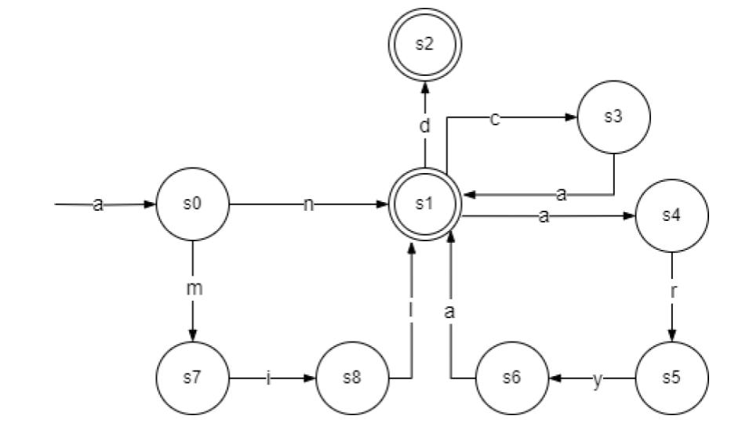

# **AutomatonElvish15: E1 Implementation of Lexical Analysis (Automaton and Regular Expression)**
Automaton and regular expression that recognizes the elvish language.

## Description

This project involves the creation of a lexical analysis parser utilizing a deterministic finite automaton (DFA) to detect and recognize words from a hypothetical elven language. Lexical analysis, a fundamental part of the compilation process, involves converting sequences of characters into meaningful tokens. This project uses a DFA to perform lexical analysis, providing a robust and efficient means of recognizing valid words within the elven language.

*The Elven language form the Lord of the Rings Saga* 
This language is fictional, originating from fantasy literature such as J.R.R. Tolkien's Middle-earth universe, referred to as a language spoken by elves in that universe (OWTTA, 2022).

The modeling technique I decided to use was a DFA because, based on the FasterCapital article (FasterCapital, 2021), DFAs accurately capture the deterministic rules of word formation and syntax, making them ideal for representing the language's grammar and vocabulary. Additionally, DFAs allow for formal analysis and validation of the language's rules, ensuring scalability and ease of maintenance as the language evolves over time.

A **deterministic finite automaton (DFA)** (JavatPoint, n.d.) is a theoretical model of computation that consists of:
- A finite set of states.
- A finite set of input symbols (the alphabet).
- A transition function that specifies the state to which the automaton moves based on the current state and the input symbol.
- A single initial state from which the computation begins.
- A set of accepting (or final) states which determine if the input string is accepted or rejected.

Mathematically (GeeksforGeeks, 2023), a DFA can be represented as a 5-tuple \((Q, \Sigma, \delta, q_0, F)\), where:
- \(Q\) is the finite set of states.
- \(\Sigma\) is the finite set of input symbols (alphabet).
- \(\delta: Q \times \Sigma \rightarrow Q\) is the transition function.
- \(s_0 \in Q\) is the initial state.
- \(F \subseteq Q\) is the set of accepting states.

Another method that I implemented was a regular expression. A regular expression (MDN, 2024) is a pattern used to match character combinations in strings. In JavaScript, regular expressions are also objects. Regular expressions are used in various fields of computer science to describe the lexemes of programming languages, search text, validate input data, etc.

Regular expressions and finite automata are closely related; in fact, any language that can be described by a regular expression can be recognized by a finite automaton. This equivalence allows the use of DFAs to implement regular expressions in practical applications.
In this project, we will use Prolog to implement the automaton because its natural fit for tasks involving symbolic computation and logical relationships. Prolog’s declarative syntax allows the representation of states, transitions, and acceptance conditions of a deterministic finite automaton (DFA). This makes Prolog an excellent choice for implementing the logical structure of our lexical analysis parser for the elven language (Unam - prolog, n.d.).
Additionally, we will implement the same automaton in Python, leveraging its readability, simplicity, and extensive libraries. Python’s clean syntax makes the implementation and maintenance of the DFA , and its versatility allows for easy integration of additional functionalities and tools. With a large community and extensive documentation, Python provides robust support for extending the DFA into larger applications, performing file I/O operations, developing graphical user interfaces, and handling complex data manipulations. This makes Python an ideal choice for building practical and extendable applications using the DFA (Python, 2024).
## Model of the Solution

This project implements a DFA to recognize valid words in an elven language and a regular expression. The DFA is defined by a set of states, transitions, an initial state, and accepting states. The implementation in Prolog includes:

- Definition of states (`state/1`).
- Initial state (`initial/1`).
- Accepting states (`accepted/1`).
- Transitions (`trans/3`).
- DFA function to check string acceptance (`dfa/1`).
- Auxiliary function to start processing (`aux/1`).
- Acceptance function to determine valid strings (`accept/2`).

The DFA processes input strings character by character, transitioning between states according to the defined transition rules. If the DFA reaches an accepting state after processing the entire input string, the string is recognized as valid. This automaton is designed to recognize words in the Elvish language. It consists of several states representing different stages of recognizing a valid Elvish word. The accepted cases are:

- an
- and
- anca
- anarya
- amil

In order to accept these words, I modeled the DFA, as follows:


As it said before, this automaton operates with the initial state "start" (s0) and two final states, "s1" and "s2", which are designated as accepted states. Transitions are defined for each state and input symbol combination (s3, s4, s5, s6, s7, s8). This DFA is designed to accept words like "amil", "an", "anarya", "anca", and "and" from the Elvish language. 

*The presented automaton is equivalent to the following regular expression:*

DFA 1 -> RE 1: 

{^a(mil|n(d|arya|ca)?)$}

## Implementation and tests

For my implementation of lexical analysis, I followed the structure defined in the "automatonElven15.pl" file. To use the file, you can input in two ways:

First, with the following format:

*dfa("amil").*

With this, the program should return *true* if it complies with the rules established in the automaton, and *false* if the string is not part of the language.

Some examples of inputs and outputs are: 
```
?- dfa('a').
[a]
false.

?- dfa("cdn").
[c,d,n]
false.

?- dfa("anarya").
[a,n,a,r,y,a]
true.

?- dfa("amil").
[a,m,i,l]
true.
```

Second, you can use the test cases from the "test.pl" file:

*Format:*

testStatusNumerodeltest.

*Example:*

testAccepted5.

In this case the program should return a message of what is expected, the string and the response provided by the automaton.

Some examples of inputs and outputs are: 
```
?- testRejected7.
Must be false: [a,n,n,a]
false.

?- testAccepted5.
Must be true: [a,m,i,l]
true.

?- testRejected4.
Must be false: [a,m,i,l,a]
false.

?- testAccepted3.
Must be true: [a,n,c,a]
true.
```

Here's a short explanation of how "automatonElven15.pl" file works:

- **States definition:** The automaton defines multiple states, including a starting state (start) and several intermediary states (s0 to s8).

- **Initial state:** The starting state is defined as 'start', indicating the initial point.

- **Accepted states:** States 's1' and 's2' are marked as accepted states, indicating that reaching these states signifies the successful recognition of an Elvish word.

- **Transitions:** Transitions between states are defined based on the input characters.

- **Acceptance function:** Defines the acceptance criteria for the input string. If the current state is an accepted state and the input string is empty, the word is accepted as an Elvish word.

- **Aux Function:** Initializes the acceptance process by starting from the initial state and recursively traversing the transitions based on the input characters.

- **DFA Function:** Converts a given string into a list of characters and initiates the acceptance process for each string. If the string is accepted, it returns true; otherwise, false.

The Prolog code defines a deterministic finite automaton (DFA) to recognize words in an elven language. It starts by defining the states, initial state, and accepting states. Transitions between states are specified based on input characters. The `dfa/1` predicate converts an input string into a list of characters and initializes the acceptance check using the `aux/1` predicate. The `accept/2` predicate recursively processes each character, transitioning through states according to the defined transitions. If the final state after processing all characters is an accepting state, the input string is accepted. This implementation demonstrates Prolog's strengths in handling symbolic computation and logical rules.

The other implementation of the automata is in the language python. The Python code implements a deterministic finite automaton (DFA) to recognize words in an elven language. The `dfa` function starts the automaton from the initial state `s0` if the first character is 'a', otherwise it rejects the string. The state functions (`s0` to `s8`) transition through the automaton based on the input characters, checking if the current character matches the expected one and moving to the next state. If the end of the string is reached in an accepting state (`s1` or `s2`), the string is accepted; otherwise, it is rejected. The automaton processes a list of test strings, printing whether each string is accepted or rejected according to the DFA's rules.

Finally, the regular expression `{^a(mil|n(d|arya|ca)?)$}` defines a pattern to match strings according to the rules of the DFA implemented in both Prolog and Python.

- `^`: Anchors the match at the beginning of the string.
- `a`: The string must start with the character 'a'.
- `(mil|n(d|arya|ca)?)`: This group matches either `mil` or `n` followed optionally by `d`, `arya`, or `ca`.
  - `mil`: Matches the substring "mil".
  - `n(d|arya|ca)?`: Matches the character 'n' followed optionally by:
    - `d`: Matches the substring "nd".
    - `arya`: Matches the substring "narya".
    - `ca`: Matches the substring "nca".
- `$`: Anchors the match at the end of the string.

In both implementations, the DFA transitions through a series of states based on the input characters, ultimately determining if the input string matches the pattern defined by the regular expression `{^a(mil|n(d|arya|ca)?)$}`. The Prolog code uses predicates to define states, transitions, and acceptance conditions, processing the input string recursively. The Python code defines the same logic using class methods and state transitions, processing the input string iteratively. Both implementations efficiently check if the input string conforms to the specified pattern, demonstrating the versatility of DFAs in different programming paradigms.

The "test.pl" file contains all the test cases for the automaton. You just need to follow these steps:
1. **Download and consult files:**

   You must download both files "automatonElven15.pl" and "test.pl". Then, open your SWI-Prolog application, where you will only consult the "test.pl" file.
   
2. **Call the function:**
  
   You should call the function of the test case you want to check, and a message will be displayed indicating the expected result, the word in question, and the response provided by the automaton, whether it is *true* or *false*.
   ```
   ?- testRejected7.
   Must be false: [a,n,n,a]
   false.
   ```
   
3. **Use this format:**

   testStatusNumerodeltest.
   
   *Example:*
   
   testAccepted5.

## Analysis
The complexity of this code primarily depends on the length of the input string and the number of transitions required to process it. Since Prolog operates on a non-deterministic and deterministic basis, and explores all possible paths, the complexity can be high for larger input strings or automata with many states and transitions. 

However, the complexity can be bounded by the size of the automaton and the length of the input string. The overall complexity of this is $O(n)$, where n is the length of the input string, because the program processes the input character by character, transitioning between states. This is equivalent to the next code:

```python
for element in list:  # Through the list
    print(element)
```

To be more specific of the analysis:

1. **State and transition definitions**:
   - **States and Transitions**: The definitions of states and transitions are declarative and static. They are specified once and do not contribute to the runtime complexity. Therefore, their complexity is O(1).

2. **DFA function**:
   - **`dfa`**:
     ```prolog
     dfa(Str) :-
         atom_chars(Str, Chars),
         aux(Chars), !.
     ```
     - **atom_chars**: Converts the input string into a list of characters. This operation is O(n), where n is the length of the input string.
     - **aux**: Invokes the auxiliary function to start the DFA processing.

3. **Auxiliary function**:
   - **`aux`**:
     ```prolog
     aux(Input) :-
         initial(InitialState),
         write(Input),
         accept(InitialState, Input).
     ```
     - **initial**: Retrieves the initial state, which is an O(1) operation.
     - **write**: Outputs the input list of characters, which is O(n).
     - **accept**: Starts the acceptance process from the initial state with the input characters.

4. **Acceptance Function**:
   - **`accept`**:
     ```prolog
     accept(State, []) :-
         accepted(State).

     accept(State, [H|T]) :-
         trans(State, H, NextState),
         accept(NextState, T).
     ```
     - **accept(State, [])**: Checks if the current state is an accepted state. This is an O(1) operation.
     - **accept(State, [H|T])**:
       - **trans**: Looks up the next state for the given current state and input character. Assuming the transition lookup is efficient (e.g., using a hash table), this is an O(1) operation.
       - **Recursive Call**: Recursively processes the rest of the input string. Each character in the input string is processed exactly once, leading to O(n) recursive calls for an input string of length n.

As said before, the time complexity of the DFA implementation is O(n), where n is the length of the input string. This complexity arises because each character in the input string is processed exactly once, with each transition and state check being an O(1) operation.

My first approach to the solution was to use an automaton in Prolog, which is also a natural solution. Initially, I constructed a DFA model with a total of 4 acceptance states, which, although maintaining complexity at $O(n)$, is suboptimal as it resulted in too many acceptance states. Upon redesigning and approaching the problem from a different perspective, I made a second approach to the problem, which only had 2 acceptance states. I chose the second DFA design because it reduced the DFA code. Additionally, another approach I took to the problem was to create an equivalent regular expression and a automaton in python, which seemed like a valid option considering the $O(n)$ complexity of the automaton in prolog. However, based on the article of geeksforgeeks (GfG, 2023), unlike regular expressions, the DFA provides clear and specific rules for accepting or rejecting specific input strings, with each state and transition representing precise lexical patterns. In contrast, logical expressions may be harder to comprehend and maintain, especially for complex strings or languages with ambiguous rules. Additionally, the DFA offers efficient string verification through step-by-step analysis with deterministic transitions, ensuring fast and predictable processing, crucial for high-performance applications like large-scale text analysis.

#### Demonstrating the Efficiency

The chosen solution for recognizing words in an elven language using a deterministic finite automaton (DFA) is highly efficient due to its linear time complexity, O(n), where n is the length of the input string. This efficiency arises because each character in the input string is processed exactly once, with constant time operations for state transitions. Both the Prolog and Python implementations exhibit this linear behavior, ensuring quick recognition even for longer strings.

1. **Regular Expressions**:
   - **Pros**: Regular expressions offer a concise and straightforward way to match patterns. They are built-in and optimized in many programming languages, including Python.
   - **Cons**: For complex patterns or multiple conditions, regular expressions can become hard to read and maintain. Additionally, they may not be as flexible for incremental modifications or expansions of the language rules.

2. **Non-deterministic Finite Automata (NFA)**:
   - **Pros**: NFAs are more flexible in terms of defining transitions, allowing multiple possible transitions for a given input and state.
   - **Cons**: Simulation of NFAs is generally less efficient than DFAs. Converting an NFA to a DFA can result in an exponential increase in the number of states in the worst case, complicating the implementation.

3. **Using Context-Free Grammars (CFG)**:
   - **Pros**: CFGs are powerful for defining more complex language structures beyond regular languages.
   - **Cons**: Parsing algorithms for CFGs (like CYK or Earley) are more computationally intensive, with worst-case time complexity ranging from O(n^2) to O(n^3), making them less suitable for simple pattern recognition tasks like ours.

After analyzing these different solutions, the DFA approach was chosen as the optimal solution due to its balance of simplicity, clarity, and efficiency. The DFA provides a clear and maintainable way to define state transitions and acceptance conditions. Additionally, the linear time complexity ensures that the solution scales well with the length of the input strings.

- **Prolog Implementation**: Leveraging Prolog's strengths in symbolic computation and logical rules, the DFA is implemented concisely, highlighting state transitions naturally.
- **Python Implementation**: Python's readability and extensive libraries support a straightforward and maintainable DFA implementation, integrating well into larger applications. By combining these implementations, the DFA approach demonstrates not only theoretical efficiency but also practical flexibility and ease of use, making it the optimal solution for the problem at hand.

## References
- FasterCapital (2021). NFA vs DFA desentranar las diferencias en los modelos de automata finitos. (https://fastercapital.com/es/contenido/NFA-vs--DFA--desentranar-las-diferencias-en-los-modelos-de-automata-finitos.html)
- OWTTA (2022). Elvish languages. One Wiki to Rule Them All. The Lord of the Rings Wiki.  (https://lotr.fandom.com/wiki/Elvish_languages)
- GfG (2023, January 28). Application of Deterministic Finite Automata (DFA). GeeksforGeeks. (https://www.geeksforgeeks.org/application-of-deterministic-finite-automata-dfa/)
- JavatPoint (n.d.). Deterministic Finite Automata - DFA. (https://www.javatpoint.com/deterministic-finite-automata)
GeeksforGeeks (2023, June 27). Introduction of finite automata. GeeksforGeeks. (https://www.geeksforgeeks.org/introduction-of-finite-automata/)
MDN (2024, January 2). Regular expressions - JavaScript. MDN Web Docs. (https://developer.mozilla.org/en-US/docs/Web/JavaScript/Guide/Regular_expressions)
Python (2024, May 28). Welcome to Python.org. Python.org. (https://www.python.org/)
Unam - prolog (n.d.). PROLOG –  acervo para el mejoramiento del aprendizaje de alumnos de  ingeniería, en Inteligencia Artificial. (https://virtual.cuautitlan.unam.mx/intar/?page_id=212)
